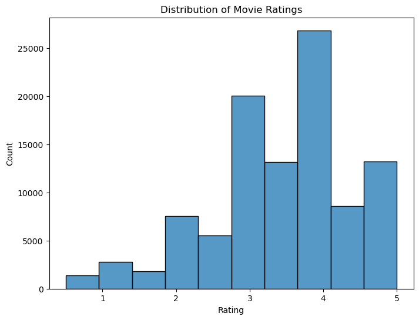
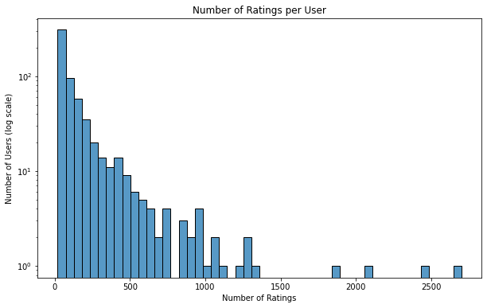
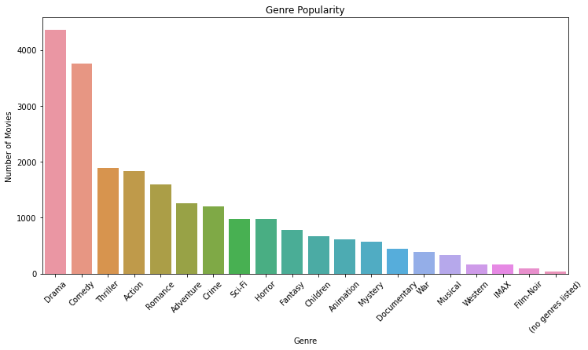
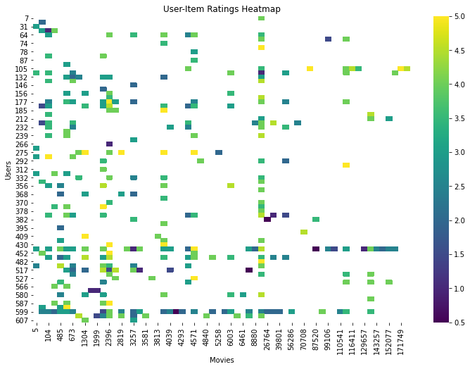

# The Flick Pick Engine

## Table of Contents
1. [Intelligent Movie Recommendations with Neural Networks and NLP](#intelligent-movie-recommendations-with-neural-networks-and-nlp)
2. [Author](#author-dsfpt07-phase-4-group-12)
3. [Overview](#overview)
4. [Problem Statement](#problem-statement)
5. [Data Understanding](#data-understanding) 
   - [Data Sources](*data-sources)
   - [Key Steps in Data Understanding](*key-steps-in-data-understanding)
6. [Data Preparation](#data-preparation)
7. [Modelling](#modelling)
8. [Conclusion](#conclusion)
9. [Recommendations](#recommendations)
10. [Possible next steps](#possible-next-steps)
11. [For more information](#for-more-information)
12. [Repository Structure](#repository-structure)

# Intelligent Movie Recommendations with Neural Networks and NLP


### Author: DSFPT07 Phase 4 Group 12
- Branely Ope
- Brian Kipngetich
- Cynthia Atieno
- Geoffrey Mwangi
- Linet Maz'susa
- Maureen Wanjeri
- Mercy Silali

## Overview
In this project, we aim to create a personalized movie recommendation system by leveraging machine learning techniques. The system predicts movies that a user is likely to enjoy based on their historical ratings and preferences. To achieve this, we explore collaborative filtering techniques, including user-based and item-based filtering. The project addresses common challenges in recommendation systems, such as the cold start problem, by using a hybrid approach that integrates content-based filtering based on movie features like genres and tags. Additionally, the system is designed for continuous improvement, incorporating user feedback to refine recommendations over time. This project follows the CRISP-DM (Cross-Industry Standard Process for Data Mining) framework, ensuring a structured and iterative approach to model development.

**Key objectives**

- Providing the top 5 personalized movie recommendations for each user.
- Enhancing recommendation quality by addressing sparsity and cold start challenges.
- Evaluating the system's performance using various accuracy and ranking metrics.

## Problem Statement


In today's digital age, the sheer volume of available movies has grown exponentially, leading to an overwhelming choice paralysis for viewers seeking content that aligns with their personal tastes. Traditional recommendation systems often fall short by providing generic suggestions based on popularity or simplistic user behaviors, failing to capture the nuanced preferences of individual users. This lack of personalization results in a suboptimal viewing experience, where users spend more time searching for movies than enjoying them.

The FlickPick Engine aims to solve this problem by developing an intelligent movie recommendation system that delivers highly personalized and relevant suggestions to users. By leveraging advanced machine learning techniques—specifically neural networks for collaborative filtering and Natural Language Processing (NLP) for content analysis—the system can understand and interpret both user preferences and movie attributes on a deeper level.

By addressing the challenges of information overload and impersonal recommendations, the FlickPick Engine enhances the movie discovery process. It empowers users to effortlessly find films that resonate with their unique tastes, thereby improving user satisfaction and engagement with the platform.
## Data Understanding
To develop the FlickPick Engine, we utilized the MovieLens 20M Dataset, a widely recognized dataset in the recommendation systems domain. This dataset provides a rich source of user ratings, movie metadata, and user-generated tags, enabling the creation of a robust and personalized movie recommendation system.

**Data Sources**
1. Ratings Data ([ratings.csv](https://github.com/geomwangi007/Movie-Recommendation-System-Group_12-Project/blob/main/Data/ml-latest-small/links.csv)): Contains 25 million ratings ranging from 0.5 to 5.0, provided by 162,541 users on 62,423 movies.
2. Movies Data ([movies.csv](https://github.com/geomwangi007/Movie-Recommendation-System-Group_12-Project/blob/main/Data/ml-latest-small/movies.csv)): Includes movie IDs, titles, and genres for all movies rated in the dataset.
3. Tags Data ([tags.csv](https://github.com/geomwangi007/Movie-Recommendation-System-Group_12-Project/blob/main/Data/ml-latest-small/tags.csv)): Consists of 1.1 million user-generated tags applied to movies, offering additional contextual information.
4. Links Data ([links.csv](https://github.com/geomwangi007/Movie-Recommendation-System-Group_12-Project/blob/main/Data/ml-latest-small/links.csv)): Provides identifiers that link MovieLens movie IDs with IDs from other databases like IMDb and TMDb.
   
**Key Steps in Data Understanding**

- Initial Exploration: Reviewed the datasets to understand the structure, key variables, and relationships between the datasets.
- Data Cleaning: Addressed missing values and data inconsistencies, and merged the datasets to create a unified dataset for modeling.
- Feature Selection: Identified key features that are most likely to impact the primary contributory cause of accidents.

**Data Visualization**


- Skew Towards Higher Ratings: The distribution is right-skewed, with most ratings clustering around 3, 4, and 5. Ratings of 4 are the most frequent, indicating that users generally rate movies quite positively.

- Few Low Ratings: There are relatively few ratings of 1 and 2, which suggests that users may be less likely to give movies extremely low scores, or that most of the movies in the dataset are well-regarded.

- Peak at Rating 4: The highest count of ratings is around 4, suggesting that many users find the movies to be above average but not necessarily perfect.
  

This type of distribution is common in user-driven ratings, where users tend to be more inclined to rate items positively than negatively.


- The distribution is often long-tailed, with a few users providing many ratings and many users providing few ratings.
- Power-Law Distribution: The distribution exhibits a power-law trend, where most users rate very few movies, and only a few users provide a large number of ratings. This type of behavior is typical in user-generated content datasets, often referred to as the "long tail."

- Majority Have Rated Few Movies: A significant number of users have rated fewer than 100 movies, which suggests that casual users dominate the dataset.

- Heavy Users: There are a small number of users who have rated over 500 movies, with some even rating over 1000. These "heavy users" contribute disproportionately to the number of total ratings in the dataset.
Genre Popularity




- Identify dominant genres (e.g., Drama, Comedy).
  
- Helps in balancing genre representation in recommendations.



Each cell indicates a user's rating for a specific movie, with colors ranging from dark (lower ratings) to bright yellow (higher ratings). Here are some insights:

1. Sparse Matrix: The heatmap is quite sparse, indicating that most users rate only a small subset of available movies. This pattern is common in user-item rating matrices for movie recommendation systems.

2. Ratings Distribution:

- Ratings are distributed across a range of values from around 0.5 to 5.
- The color gradient represents different ratings, with dark blue for low ratings (close to 0.5) and bright yellow for high ratings (close to 5).
3. Few Highly Rated Items: There are only a few instances of bright yellow cells, implying that while there are high ratings, they are not very common. Users tend to rate movies more conservatively or moderately.

4. Clusters of Activity: There are small clusters of ratings, which might indicate a group of popular movies that have been rated by multiple users. This suggests that some movies have broader appeal while many others have only a handful of ratings.

5. Recommendation System Implication: The sparsity in the matrix is a common challenge in recommendation systems, making collaborative filtering techniques ideal since they can leverage the similarities between users or items to fill in the missing ratings.

## Data Preparation

1. Data Cleaning: The dataset is cleaned by removing missing values and duplicates.
2. Data Transformation:
   - Movie titles, genres, and tags are preprocessed.
   - Ratings are transformed into a matrix format for collaborative filtering.

3. Feature Engineering:
   - The system uses movie genres and user behavior to enhance recommendation accuracy.
   - Tags are grouped using clustering techniques, reducing complexity and enhancing the content-based recommendation model.
4. Train-Test Split:
   - The dataset is split into training and testing sets to ensure proper model evaluation.
## Modelling
Two main models are used in this recommendation system:

1. Collaborative Filtering:
   - User-based Collaborative Filtering: Recommends movies to users based on similarities with other users.
   - Item-based Collaborative Filtering: Recommends movies based on similarities between movies.
2. Hybrid Model:
   - To solve the cold start problem (when little information is available about new users or items), a hybrid model is implemented by integrating content-based features such as genres and tags.
   - 
The clustering model is also used to condense movie tags for content-based filtering, using Agglomerative Clustering to reduce tag complexity.

## Conclusion
**Model Performance**
- SVD (Singular Value Decomposition) model achieved a validation RMSE of 0.8822 and a test RMSE of 0.8838, indicating stable performance across both validation and test sets​(vertopal.com_Main).

- Hyperparameter tuning improved SVD's performance, bringing the final test RMSE down to 0.8603, showing that the model benefits from parameter optimization.

- KNNBaseline model performed almost identically to the SVD model, with a test RMSE of 0.8598, showing a negligible difference in performance.

- SVD++ model, while incorporating implicit feedback, did not outperform the SVD model, with a test RMSE of 0.8603​(vertopal.com_Main). This suggests that while implicit feedback can help, it may add complexity that doesn't always lead to better performance in this dataset.

- Hybrid Recommendation System: The combination of SVD and KNN in a hybrid model further improved predictions, with a test RMSE of 0.8597​(vertopal.com_Main). Combining collaborative filtering and neighborhood-based approaches captures different aspects of user preferences, leading to a more accurate recommendation system.

**Precision@K and Recall@K**
- The hybrid model's precision@10 was computed at 0.6341, and recall@10 at 0.5324​(vertopal.com_Main), indicating that the system is effective at ranking relevant items in the top 10 recommendations, though there is still room for improvement.

**Data Insight**
Ratings Distribution: The dataset is skewed toward higher ratings, with most ratings clustering around 4.0. This is a common pattern in user-generated movie reviews.

- User Behavior: The analysis of ratings per user shows a power-law distribution, where a few users rate many movies while most users rate only a few. This user behavior suggests that the system should focus on better recommendations for users who rate fewer movies to improve engagement.

- Genre Trends: Drama, Comedy, and Action are the dominant genres. Over time, there has been a noticeable decline in movie production across all genres, especially since the early 2000s​(vertopal.com_Main).

## Recommendations

**Optimizing the Hybrid Model Weights Based on User Behavior**
- We have seen promising results from our hybrid model, which combines SVD and KNN. However, we can improve further by dynamically adjusting the weights between collaborative filtering and content-based filtering based on user behavior: For heavy users (those with many ratings), giving more weight to collaborative filtering makes sense, as we have sufficient interaction data to work with.

- For new or infrequent users, content-based filtering should have a stronger influence since their interaction history is limited. To validate this, we could run A/B tests with different weight configurations to observe the impact on user engagement and satisfaction.

**Expanding the Cold-Start Strategy**
We know that cold-start users, or those with minimal interaction data, pose a challenge. To mitigate this, we can implement the following:

- Onboarding questionnaires to gather explicit preferences from new users, such as favorite genres or actors, which can help guide early recommendations.

- Richer item metadata by incorporating features like director, cast, or awards into content-based filtering. This would improve recommendations for users who have little or no rating history.

- External data sources like IMDb or Rotten Tomatoes could enrich our content-based model with more descriptive information.

**Improving Precision@K and Recall@K Metric**
Our hybrid model performed reasonably well with a Precision@10 of 0.6341 and a Recall@10 of 0.5324, but we can improve these by adjusting the way we rank relevant items. Specifically:

- Implementing a re-ranking mechanism using contextual signals (e.g., time of day, recent trends) to surface items that are more relevant at the moment of recommendation.

- We should also focus on improving diversity and novelty in recommendations, ensuring that we occasionally suggest less popular but highly rated movies, which could enhance user discovery and satisfaction.

**Regular Hyperparameter Tuning**
- We observed that hyperparameter tuning improved our models' performance, so it makes sense to implement a regular scheduled tuning process as more user data is collected. To make this process more efficient, we could automate hyperparameter tuning using AutoML tools .

**Incorporating Temporal Dynamics**
- User preferences change over time, and our model needs to adapt to this. We can improve our system by incorporating temporal dynamics, giving more weight to recent interactions than older ones. This can be done by using time-weighted ratings or by implementing time-aware collaborative filtering techniques.

- We can also analyze seasonal trends or user behavior patterns over time to refine our recommendations.

**Encouraging Broader Data Collection**
- We observed that popular movies dominate user ratings, leaving many items underexplored. To address this, we should encourage users to rate a wider variety of movies. We can achieve this by offering incentives, such as badges for rating different genres, or by using active learning to strategically ask users to rate specific movies that have less interaction data.

## Possible next steps
### Deploying and Track Model Performance:
- Our next priority is to deploy the hybrid model (SVD + KNN) and monitor its performance using Precision@K, Recall@K, and RMSE. We should also integrate user engagement metrics such as click-through rates or time spent watching recommended content to get a more holistic view of the system’s effectiveness.

- Setting up real-time feedback loops will be essential for adapting the recommendations based on ongoing user interactions.

 ### Exploring Advanced Deep Learning Approaches:
- While our current models perform well, there is room for improvement with more advanced techniques. We plan to explore Neural Collaborative Filtering (NCF) or Autoencoders to model more complex user-item interactions and boost accuracy.

- In addition, we could try sequence-based models like Recurrent Neural Networks (RNNs) to capture sequential viewing behavior, such as what users tend to watch after a particular genre or movie.

### Evaluating with Additional Metrics:
- Beyond RMSE, we need to incorporate additional evaluation metrics such as Normalized Discounted Cumulative Gain (NDCG) and F1-score to assess the quality of our ranking. These metrics will give us more insight into how well the system identifies relevant content. We should also conduct A/B testing to compare different recommendation strategies, ensuring that our hybrid approach outperforms simpler systems.

### Incorporating More Features for Hybrid Models:
- To enhance the personalization of our recommendations, we can expand the features used in content-based filtering. Adding attributes such as actor popularity, director information, and movie sentiments from external reviews or social media can enrich our model and make recommendations more relevant.

- We can experiment with cross-features like actor-genre or director-year combinations to capture complex patterns and improve niche recommendations.

### Implementing Continuous Learning:
- It is crucial that our system continuously learns from user feedback. We can set up feedback loops that allow the system to re-learn and improve based on actions like likes, dislikes, or movie completions.

- Leveraging reinforcement learning techniques, we could develop an adaptive system that evolves its recommendations over time, based on both short-term and long-term user interactions.

### User-Centric Personalization:
- Giving users more control over their recommendations can improve engagement. We should allow users to adjust their preferences (e.g., highlighting favorite genres or hiding unwanted content). This kind of personalization will foster a deeper connection between the users and the system.

- We also plan to develop user segmentation strategies that identify different types of viewers (e.g., binge-watchers vs. occasional viewers) and tailor our recommendations to their specific behaviors.
## For more information
- Detailed documentation of the data, methodologies, and code used in this project is available upon request.

## Repository Structure
```bash
Project-Ph4-The-Flick-Pick-Engine-main/
├── notebooks/
│   └── main_index.ipynb       # Main Jupyter Notebook with code and analysis
├── readme_images/             # Images used in the README.md
├── visuals/                   # Visualizations generated during the analysis
├── Non_technical_Presentation/ # Folder containing slides or presentations for a non-technical audience
├── .gitignore                 # Git ignore file
└── README.md                  #

